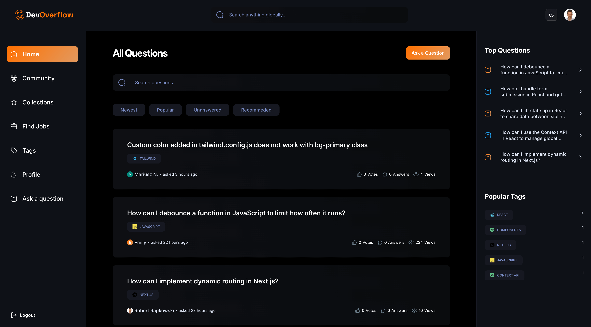

## <a> 🖥️&nbsp;&nbsp; DevHub (Fullstack)</a>

<br />

<p>
	
</p>

<p>
	DevHub is my biggest project to date - it's a full-stack application inspired
	by StackOverflow but enhanced with AI capabilities, creating a comprehensive
	community-driven platform where developers can ask questions, share knowledge,
	and accelerate their professional journey. This application leverages Next.js
	advanced rendering strategies (SSG, ISR, SSR, PPR, Server Functions, Caching,
	and Revalidation) alongside MongoDB for data storage and NextAuth for
	versatile authentication options including Email/Password, GitHub, and Google.
	With sleek styling provided by TailwindCSS and ShadCN UI, DevHub offers a
	complete ecosystem where users can post questions, provide answers, utilize
	AI-powered responses, vote on contributions, organize content with tags, earn
	badges through gamification elements, discover relevant job opportunities, and
	explore personalized recommended topics.
</p>

<p>
	<a href="https://devhub-prod.vercel.app" target="_blank"
		>Live demo - see it in action</a
	>
</p>

<p>
	<a href="https://github.com/Rapkowsky/dev-hub" target="_blank"
		>Github repo - see more details</a
	>
</p>

<br />

<p>
	
</p>

<br />

## <a> 🔋&nbsp;&nbsp; Core Features</a>

- &nbsp;🔒&nbsp;&nbsp; **Authentication:** Secure sign-in with NextAuth, supporting Email/Password, Google, and GitHub.
- &nbsp;🏠&nbsp;&nbsp; **Home Page:** Displays questions with filters, search, and pagination for easy navigation.
- &nbsp;✨&nbsp;&nbsp; **Recommendations:** Personalized suggestions on the home page.
- &nbsp;📐&nbsp;&nbsp; **Complex Layout:** Organized layout with popular questions and tags in view.
- &nbsp;❓&nbsp;&nbsp; **Question Details:** View questions with rich content, including images and code blocks.
- &nbsp;👍&nbsp;&nbsp; **Voting:** Upvote/downvote on questions to highlight helpful content.
- &nbsp;👁️&nbsp;&nbsp; **View Counter:** Tracks the number of views for each question.
- &nbsp;🔖&nbsp;&nbsp; **Bookmarking:** Save questions for quick access later.
- &nbsp;✍️&nbsp;&nbsp; **Answer Posting:** MDX editor with light/dark modes for submitting answers.
- &nbsp;🤖&nbsp;&nbsp; **AI Answer Generation:** Get AI-generated responses to questions.
- &nbsp;🗂️&nbsp;&nbsp; **Answer Filtering:** Sort answers by newest or most-voted, with pagination.
- &nbsp;⬆️&nbsp;&nbsp; **Answer Voting:** Upvote/downvote answers to rank quality responses.
- &nbsp;📚&nbsp;&nbsp; **Collections:** Organized saved questions with filters, search, and pagination.
- &nbsp;🌐&nbsp;&nbsp; **Community:** Browse all users with search, filters, and pagination.
- &nbsp;👤&nbsp;&nbsp; **Profile:** View user info, badges, and engagement history with pagination.
- &nbsp;💼&nbsp;&nbsp; **Job Finder:** Discover jobs with filters and search, tailored to the user’s location.
- &nbsp;🏷️&nbsp;&nbsp; **Tags Page:** List of all tags with question counts, filters, and pagination.
- &nbsp;🏷️&nbsp;&nbsp; **Tag Details:** View questions by tag with search and pagination.
- &nbsp;➕&nbsp;&nbsp; **Ask a Question:** Simple interface for posting new questions.
- &nbsp;✏️&nbsp;&nbsp; **Edit & Delete:** Update or remove questions and answers with validation and authorization.
- &nbsp;🔍&nbsp;&nbsp; **Global Search:** Find content across questions, users, tags, and more.
- &nbsp;📱&nbsp;&nbsp; **Responsive Design:** Fully optimized for a seamless experience on desktops, tablets, and mobile devices.
- &nbsp;⚡&nbsp;&nbsp; **High Performance:** Fast loading and smooth interactions for an efficient user experience.
- &nbsp;♻️&nbsp;&nbsp; **Code Architecture:** Component-driven, modular, and focused on reusability.

<br />

## <a name="local-development"> ⚙️&nbsp;&nbsp; Local Development</a>

0.  **Prerequisites** <br>
    Make sure you have the following installed on your machine:

    - [Git](https://git-scm.com/)
    - [Node.js](https://nodejs.org/en) (v20+)
    - [npm](https://www.npmjs.com/) (Package Manager)

1.  **Clone the repository:**

    ```bash
    git clone https://github.com/Rapkowsky/dev-hub.git
    ```

2.  **Navigate to the project directory:**

    ```bash
    cd dev-hub
    ```

3.  **Install dependencies:**

    ```bash
    npm install
    ```

4.  Create a new file named `.env` in the root of your project and add the following content:

    ```

    # Mongodb
    MONGODB_URI=

    # OpenAI
    OPENAI_API_KEY=

    # Rapid API
    NEXT_PUBLIC_RAPID_API_KEY=

    # Auth
    AUTH_GOOGLE_ID=
    AUTH_GOOGLE_SECRET=
    AUTH_GITHUB_ID=
    AUTH_GITHUB_SECRET=
    AUTH_SECRET=
    NEXTAUTH_URL=

    # Tiny Editor
    NEXT_PUBLIC_TINY_EDITOR_API_KEY=

    NEXT_PUBLIC_SERVER_URL=

    NODE_ENV=

    ```

    Replace the placeholder values with your actual credentials. You can obtain these credentials by signing up on the respective websites

5.  **Running the Project**

    ```bash
    npm run dev
    ```

    Visit &nbsp;[http://localhost:3000](http://localhost:3000)&nbsp; to access your app.

<br>
